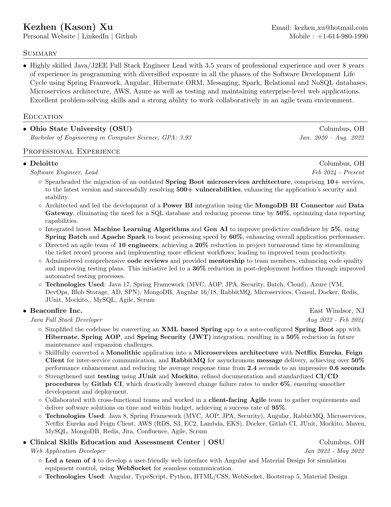
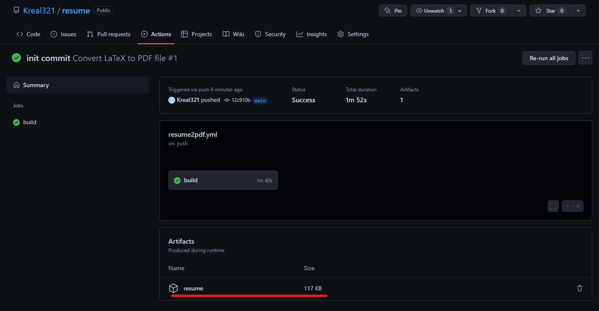

# Resume Template and Workflow
A simple workflow for creating your own single-page, one-column resume in LaTeX format, then convert it to a PDF file automatically by Github Action.

The base LaTeX template is from [Sourabh Bajaj](https://github.com/sb2nov/resume).

The LaTeX environment docker file [link](https://hub.docker.com/r/kreal321/latex).

# Preview


# Ways to convert LaTeX to PDF
1. Using Github Action (recommand)
2. Using docker to pull/build the environment, then convert locally.

## 1. Using Github Action (recommand)
Each time you make a push to the Github, the github action will automatically convert your resume.tex file to a PDF file using around 2 minutes. You can directly download your resume from that action, under the artifact.



If you change the name of the LaTeX file, you also need to change it in the [resume2pdf.yml](/.github/workflows/resume2pdf.yml) file under .github folder.

If you want to convert it locally, please delete the [resume2pdf.yml](/.github/workflows/resume2pdf.yml) file under .github folder. Otherwise, the action will be run each time you push. 

Attention: There is a github action usage limit per month for public and private repositories. [See more](https://docs.github.com/en/actions/learn-github-actions/usage-limits-billing-and-administration#usage-limits)

## 2. Build and convert locally
Remember to delete the [resume2pdf.yml](/.github/workflows/resume2pdf.yml) file under .github folder if you don't want Github help you convert the file.

## 2.1 Build Environment

### Pull from Docker Hub (Recommended)
```
docker pull kreal321/latex:stable
```
### Or you can build on your computer
This environment is a simplified version with less compatibility, but should be enough for convert a resume. 
```sh
docker build -t latex .
```

## 2.2 Transform LaTeX to PDF
### Windows (PowerShell)
```powershell
docker run --rm -i -v ${PWD}:/data latex pdflatex Kezhen_Xu_Resume.tex
```
### Windows (cmd)
```cmd
docker run --rm -i -v %cd%:/data latex pdflatex Kezhen_Xu_Resume.tex
```
### Mac / Linux
```sh
docker run --rm -i -v "$(pwd):/data" latex pdflatex Kezhen_Xu_Resume.tex
```

## License
Format and Workflow is MIT but all the data is owned by Kezhen Xu.
